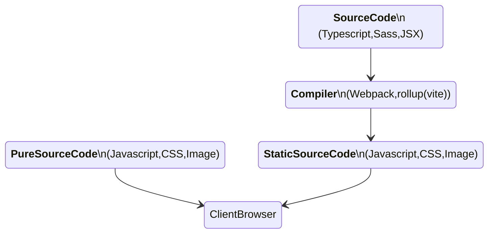

# Compiler

```mermaid
stateDiagram
    state "<b>PureSourceCode</b>\n(Javascript,CSS,Image)" as Source
    state "<b>StaticSourceCode</b>\n(Javascript,CSS,Image)" as Static
    state "<b>Compiler</b>\n(Webpack,rollup(vite))" as Compiler
    state "<b>SourceCode</b>\n (Typescript,Sass,JSX)" as SourceCode

    Source --> ClientBrowser

    SourceCode --> Compiler
    Compiler --> Static
    Static --> ClientBrowser
```