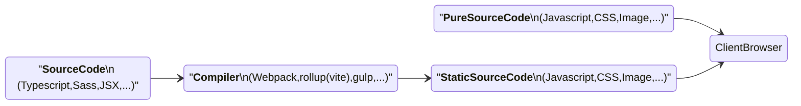

# Compiler

```mermaid
stateDiagram
    direction LR
    Source: "<b>PureSourceCode</b>\n(Javascript,CSS,Image,...)"
    Static: "<b>StaticSourceCode</b>\n(Javascript,CSS,Image,...)"
    Compiler: "<b>Compiler</b>\n(Webpack,rollup(vite),gulp,...)"
    SourceCode: "<b>SourceCode</b>\n (Typescript,Sass,JSX,...)"

    Source --> ClientBrowser

    SourceCode --> Compiler
    Compiler --> Static
    Static --> ClientBrowser
```